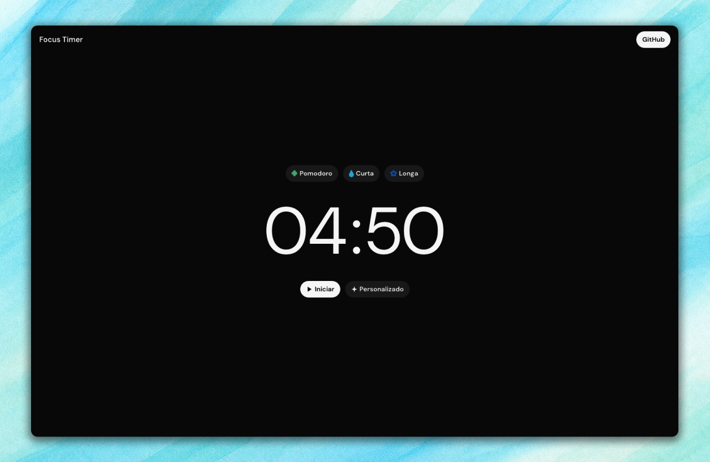

# Focus Timer

Um timer com interface limpa e minimalista. Possui presets para ciclos de foco e descanso, além de opção de tempo personalizado.

## Layout

Você pode encontrar o design da interface do usuário do projeto aqui: [Acessar design.](https://www.figma.com/design/g78BdbnZ4sdZDNxJm1NiH6/Focus-Timer---UI?node-id=0-1&t=eETYWpJoCY9J71ls-1)

## Recursos

Possui alguns Presets para definir um tempo de forma rápida (Pomodoro, Pausa curta e Pausa longa), e também possui a opção de definir o tempo de forma personalizada.

## Observações

Este projeto foi feito como experimento pessoal de UI e controle de tempo. Sinta-se à vontade para clonar, modificar ou contribuir.

Para acessar o timer e utilizar, basta clicar no link em [Acessar projeto.](https://focustimerapp.vercel.app/)
